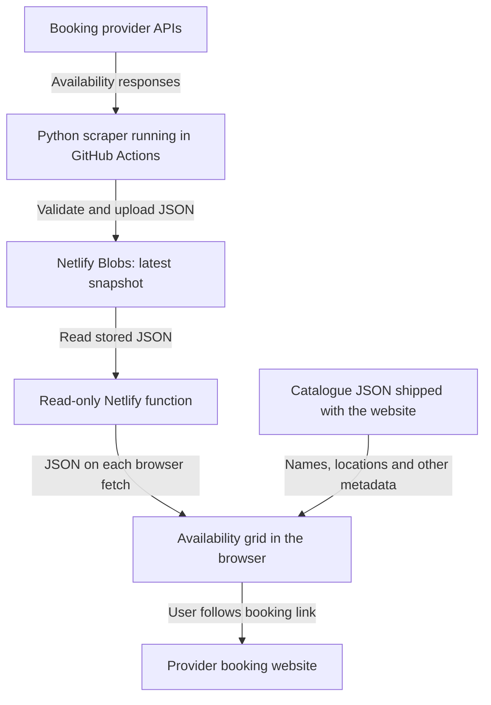

# Public Courts Across London

A local planner for public tennis, squash and padel courts in London. It shows researched booking rules, indicative prices, evening suitability, maps and distance sorting. Its time-first view shows the most recently saved availability snapshot for supported venues; it does not book courts.

## Run locally

Use Node 24, then from this directory:

```sh
npm install
npm run dev
```

If `nodenv` has not put Node 24 on your path, run the dev command with:

```sh
PATH="/Users/wang_to/.nodenv/versions/24.18.1/bin:$PATH" npm run dev
```

`npm test` checks booking logic and the static-data joins. `npm run build` checks the production build.

## Static data

`data/venues.json` is the central venue directory. Each venue has a stable `id`, name, borough, area, sport, booking link and source references. `data/prices.json` and `data/coordinates.json` join to it by that ID. `app/booking.ts` parses the three files into complete venue objects and creates the card labels from structured fields.

Every venue ID must have an entry in both joined files. A `null` price entry means no **structured tariff** has been recorded; older venue notes may still contain price text. A `null` coordinate entry means a map pin has not been verified. The parser rejects duplicate IDs, stray price or coordinate IDs, and missing entries.

Published prices are individual rates with `amount_gbp`, `duration_minutes`, applicable `modes`, and, where standardized, `customer` and `time_band`. The card's indicative range uses applicable rates of the same duration; it does not estimate an unpublished price.

The collected source records live one directory up in `data/research/`. After editing them, rebuild and copy the app snapshot:

```sh
cd ..
python3 scripts/build_directory.py
cp data/london-racquet-venues.json site/data/venues.json
```

When adding a venue, add its ID to both `site/data/prices.json` (use `null` if no structured price is known) and `site/data/coordinates.json` (use `null` if no reliable pin is known), then run `npm test` from `site/`.

Run `.venv/bin/python scripts/provider_inventory.py` to rebuild the [metadata-refresh coverage report](docs/provider-coverage.md) and [per-venue source inventory](docs/provider-inventory.json). The report keeps the configured metadata source family separate from the booking-link hostname.

## Metadata ingestion foundation

`config/venues.yaml` is the curated registry of venue IDs, sports, source adapters, booking links and metadata-source links. It was initially seeded from the existing site data; `provider: html` means the underlying booking system has not been confirmed. Observed facts belong in the provider-independent types in `ingestion/models.py`, not in the registry.

The Python setup is local:

```sh
uv sync
.venv/bin/python -m unittest discover -s tests -v
```

The ClubSpark pilot fetches public HTML and previews a normalized metadata patch for one registry venue:

```sh
.venv/bin/python -m ingestion.providers.clubspark hammersmith-and-fulham-brook-green-tennis
```

Its parser is fixture-tested against Brook Green Tennis, Finsbury Park and Cottenham Park. The source pages are saved in `tests/fixtures/` (with form tokens redacted). Unclear price duration and conflicting booking windows or release clocks remain unknown. The preview does not change the app's JSON; validation and diffing are the next ingestion milestone.

The OpenActive pilot reads a curated Better `FacilityUse` item for Gunnersbury tennis or Finsbury squash and emits the same patch shape:

```sh
.venv/bin/python -m ingestion.providers.openactive hounslow-gunnersbury-park-sports-hub
```

It records individual-court count and common court hours from the public JSON. It does not infer price, booking window or slot duration. The saved Better fixtures are CC-BY 4.0; display use requires attribution to Better.

`ingestion.review.review_metadata(existing, candidate)` validates a refreshed record and returns field-level changes. Invalid values and disappearance of previously known values make `safe_to_apply` false; `format_review(...)` produces a local text report. This layer does not write or accept changes.

## Refresh metadata

List or preview the supported providers before making requests:

```sh
.venv/bin/python scripts/refresh_metadata.py --list
.venv/bin/python scripts/refresh_metadata.py --provider everyoneactive --plan
.venv/bin/python scripts/refresh_metadata.py --provider placesleisure --plan
.venv/bin/python scripts/refresh_metadata.py --all
```

The script fetches the tested ClubSpark, Everyone Active, Places Leisure and Better OpenActive sources with provider request pacing and hard request caps. It applies only observed fields and atomically writes `data/ingestion-metadata.json`. Failed sources retain their last good records while other venues continue; the command returns a failure status after saving successful updates. Invalid normalized metadata still aborts the run. Omitted fields retain their saved values and explicit collection shrinkage is blocked. The frontend JSON is not changed.

## Availability pilot

Refresh the six dates currently exposed by Better locally with:

```bash
.venv/bin/python scripts/refresh_availability.py --all
```

The site-wide switch is `lta_enabled` in `config/site-settings.json`. It defaults to `false`: availability `--all` skips LTA Play and metadata `--all` skips ClubSpark; explicit `--provider lta` or `--provider clubspark` exits before making requests. The publisher drops any older LTA results, and the site hides LTA availability while showing a notice. Set it to `true` and deploy the site and workflow code to include LTA in future manual refreshes, if LTA access is authorized. Booking links and static venue metadata stay available in either state.

With LTA off, the refresh reads public booking JSON for 38 verified venues: 21 Better venues across 24 products, two Royal Parks padel venues on the shared Flow API, eight Playtomic padel venues, three Game4Padel venues on MATCHi, and four Padel Mates venues. Enabling LTA adds 206 former ClubSpark venues now exposed through LTA Play, for 244 venues total. Better products at Sutton and Lee Valley are combined and duplicate court-times are removed. All provider responses emit provider-independent price and duration observations from the slots already fetched; Better and Royal Parks also expose booking-window and release-time observations. Fresh observations override those fields on location cards while the catalogue continues to supply other facts; stale observations are removed with their provider snapshot. When enabled, LTA Play is queried once per venue and date; Playtomic and MATCHi preserve each available duration and GBP price. MATCHi fetches each facility once and each court once for the full date range. Requests run without parallel bursts and stop for that provider on the first error. Request starts are at least one second apart for Better, Royal Parks, LTA Play and Playtomic, and ten seconds apart for MATCHi and Padel Mates. Each provider is refreshed independently and written atomically as provider-independent slots to the ignored local file `data/availability.json`. Nine Better catalogue entries, 26 ClubSpark catalogue entries that could not be matched safely to LTA Play, and three padel venues remain unsupported. The site reads the latest published snapshot from `/.netlify/functions/availability` on first visit and checks every 30 minutes while visible. Netlify and browsers reuse a successful response for up to 30 minutes; returning to a tab does not trigger a check. Its **Find a time** view shows checked days as columns and start times as rows; selecting a cell lists locations with free courts at that exact start time and duration, along with product-specific booking links. The view shows each provider's check time and excludes that provider's slot counts after two hours.

On the deployed Netlify site, the read-only function serves the `latest` key in the site-wide `court-availability` Blob store. The publisher replaces successful provider snapshots and carries forward the latest successful snapshot for a failed provider; if every provider fails, nothing is replaced. The manual GitHub Actions workflow runs the existing Python scraper and `scripts/publish_availability.mjs`. Set GitHub Actions repository secrets `NETLIFY_SITE_ID` (Netlify project ID) and `NETLIFY_AUTH_TOKEN` (a Netlify personal access token with access to that project), then run **Refresh court availability** with **Run workflow** when staged validation is complete. New snapshots do not commit data or rebuild the site; only changes to the site code or function require a Netlify deploy.

### Activate snapshot refresh on Netlify

1. Deploy this code to your existing Netlify project once, including `netlify/functions/availability.mjs`.
2. In Netlify, copy **Project configuration → General → Project information → Project ID**. This is the value for `NETLIFY_SITE_ID`.
3. Create a Netlify personal access token under **User settings → Applications → Personal access tokens**.
4. In the GitHub repository, open **Settings → Secrets and variables → Actions** and create repository secrets named `NETLIFY_SITE_ID` and `NETLIFY_AUTH_TOKEN` with those values. Keep the token in secrets, never in source code or browser configuration.
5. Once the workflow is on the default branch, open **Actions → Refresh court availability → Run workflow**. Its first successful upload creates the store and snapshot automatically.
6. Open `https://YOUR-NETLIFY-DOMAIN/.netlify/functions/availability`. It should return JSON with a recent `generated_at`. Then open **Find a time** on the site.

Scheduling is intentionally disabled during staged validation. When enabled later, the open page will check every 30 minutes while visible, independently of the refresh frequency. If refresh fails, the previous snapshot remains stored; the page hides counts and API-derived metadata once they are over two hours old.

The scraper's per-run request caps are 150 Better, 50 Playtomic, 50 MATCHi, 30 Padel Mates and 20 Royal Parks requests (300 combined with LTA off). Enabling LTA adds a 1,250-request cap (1,550 combined). These are our own safeguards, not published provider allowances. They reset on each run, so the manual workflow does not enforce an hourly limit across repeated runs.

`npm run dev` runs the frontend only and does not serve the Netlify function. Local scraping still writes the ignored JSON for inspection; it does not publish it. Use the local integration preview below to test storage-to-browser behaviour without deploying. Cloud credentials and the scheduled job still need a separate check when deployment is enabled.

### Local integration preview (synthetic data)

The intended hosted flow (deployment and scheduled refreshes are currently inactive):



The local preview replaces the provider calls and scheduled scraper with manual sample updates, and Netlify Blobs with its local emulator. The function and browser use the production code. The deployed site uses a 30-minute shared and browser cache and checks every 30 minutes while visible. The local preview disables caching so reloading the page shows a newly selected scenario without rebuilding the website. Failed fetches retain the previous snapshot with a warning; counts and API-derived metadata older than two hours are hidden.

With Node 24, run from this directory:

```sh
npx next build
node scripts/preview_availability.mjs
```

Open `http://127.0.0.1:3100` and choose **Find a time**. If that port is occupied, run `PORT=3105 node scripts/preview_availability.mjs` and open port 3105 instead. The preview uses the installed Netlify SDK's local Blob server, temporary storage, our actual availability function, and the built website. It first asserts that the function returns 503 for missing data and advertises a 30-minute shared and browser cache for successful snapshots. The local preview overrides that cache while testing scenarios. No Netlify credentials, provider calls, uploads, deployments, or GitHub jobs are used. The displayed courts and prices are synthetic test data.

Type a scenario in the terminal:

| Command | Expected behaviour after reloading the page |
| --- | --- |
| `fresh` | One location with two sample courts |
| `changed` | Same location with one sample court |
| `missing` | Function returns 503; a previously loaded snapshot remains with a refresh warning |
| `invalid` | Malformed data is rejected; the previous snapshot remains with a warning |
| `stale` | Three-hour-old snapshot hides counts and displays an expiry message |
| `quit` | Stops the preview and removes its temporary Blob storage |

After entering a scenario, reload the local preview page to see it. Returning to the tab does not fetch again. For a first-load failure check, use `missing` and then reload the browser: the time view should show availability unavailable.

References: [Netlify Blobs setup and project ID](https://docs.netlify.com/build/data-and-storage/netlify-blobs/), [GitHub Actions secrets](https://docs.github.com/en/actions/how-tos/write-workflows/choose-what-workflows-do/use-secrets).

The LTA Play adapter normalizes public court slots and prices, links to the selected date, and tells visitors that an account is required to book. The Playtomic adapter reads public padel availability without an account; completing a booking remains on Playtomic.
